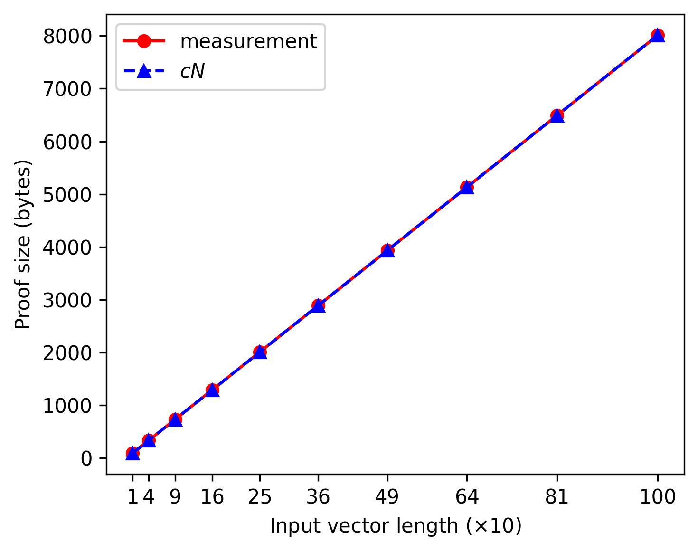
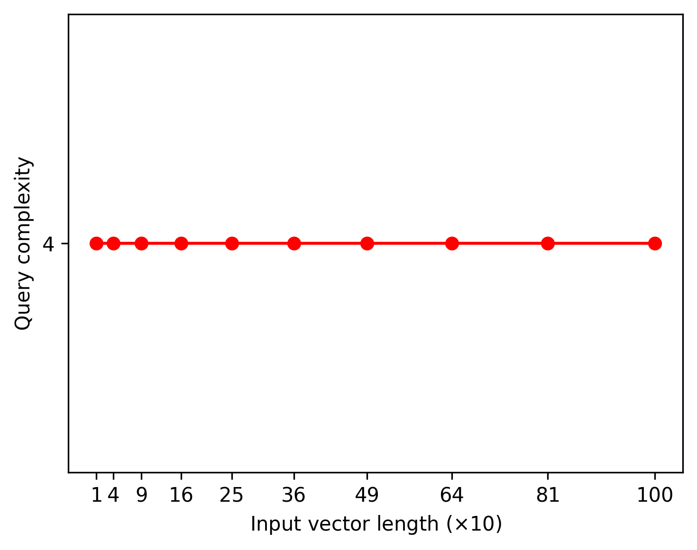
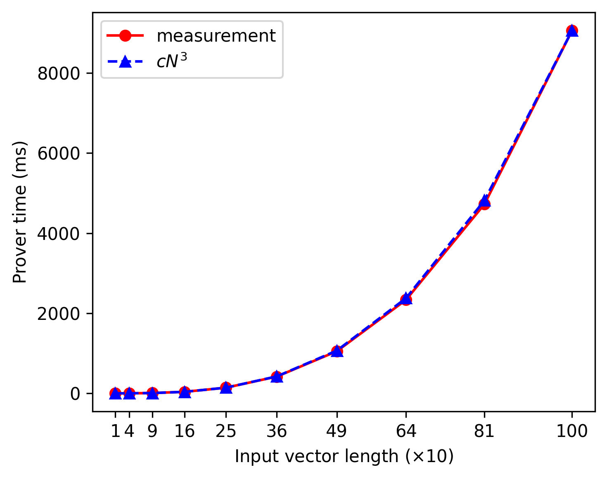
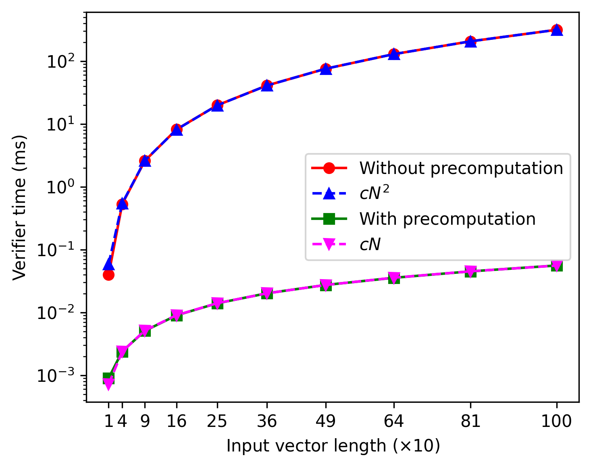
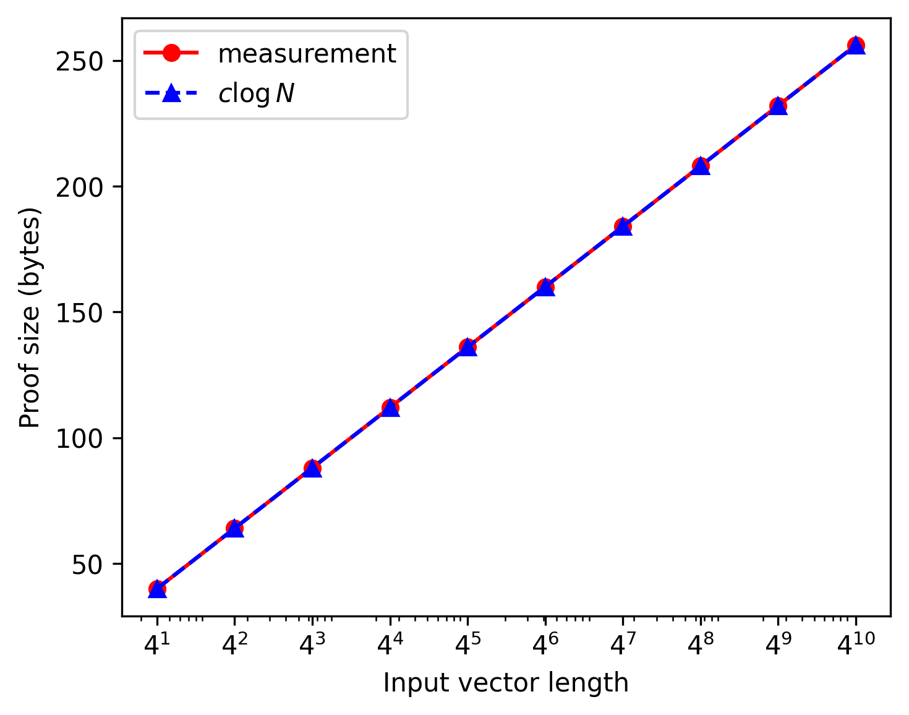
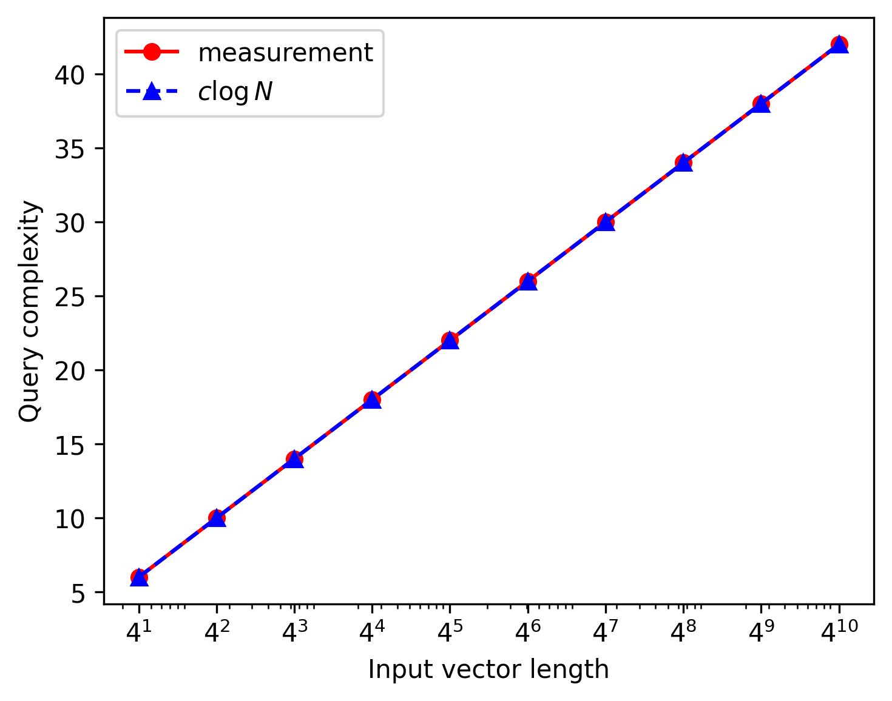
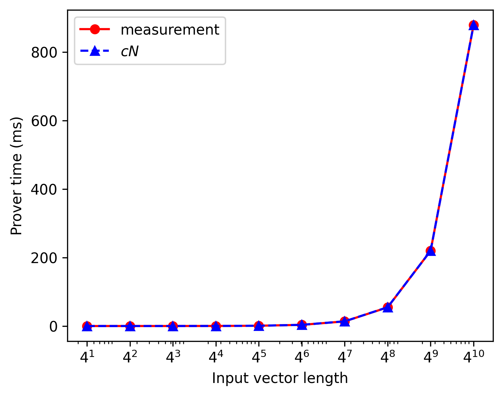
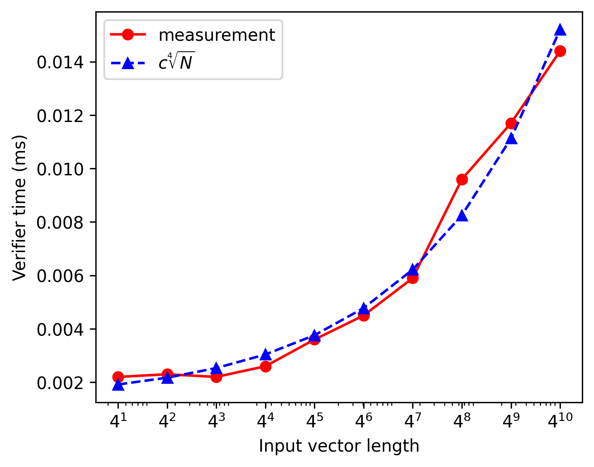

# Fully Linear PCP Simulator for Inner Product Circuits

This repository is the C++ implementation of the improved version of original FLPCP for inner product circuit.
Fully linear PCP (FLPCP) is zero-knowledge proof scheme which can be efficiently applied on distributed or secret-shared data by leveraging short linear proofs. ([Dan Boneh et al. 2019](#Reference))
This project is developed on Visual Studio CMake project and Windows 11 environment.

## Project Structure

* `circuit` - logic constructing proofs and queries of FLPCP and FLIOP.
* `experiments` - performance measurement of primitive modular operations, and simulation logic of 2PC, 3PC using FLPCP and FLIOP.
* `figure` - experiment result graphs and its poltting Python code.
* `math` - logic of primitive modular operations and polynomial interpolation.
* `unit` - class representing proof and query.
* `win-x64-release` - complied executable files for x64 windows environment.

## Experiment Results

### FLPCP Complexity (Baseline)

- Proof Size: $O(N)$
    
    
    

- Query Complexity: $O(1)$
    
    
    

- Prover Time: $O(N^3)$
    
    
    

- Verifier Time: $O(N^2)$
    
    
    

### FLPCP Coeff. Complexity (Baseline)

- Proof Size: $O(N)$
    
    
    

- Query Complexity: $O(1)$
    
    
    

- Prover Time: $O(N^2)$
    
    
    

- Verifier Time: $O(N)$
    
    
    

### Compare FLPCP (Baseline)

- Prover Time
    
    
    

- Verifier Time
    
    
    

### FLPCP Complexity ($\sqrt{N}$ Optimization)

- Proof Size: $O(\sqrt{N})$
    
    
    

- Query Complexity: $O(\sqrt{N})$
    
    
    

- Prover Time: $O(N^2)$
    
    
    

- Verifier Time: $O(N\sqrt{N})$
    
    
    

### FLPCP Coeff. Complexity ($\sqrt{N}$ Optimization)

- Proof Size: $O(\sqrt{N})$
    
    
    

- Query Complexity: $O(\sqrt{N})$
    
    
    

- Prover Time: $O(N\sqrt{N})$
    
    
    

- Verifier Time: $O(N\sqrt{N})$
    
    
    

### Compare FLPCP ($\sqrt{N}$ Optimization)

- Prover Time
    
    
    

- Verifier Time
    
    
    

### FLIOP Complexity

- Proof Size: $O(\log_2{N})$
    
    
    

- Query Complexity: $O(\log_2{N})$
    
    
    

- Prover Time: $O(N)$
    
    
    

- Verifier Time
    
    
    
    Preduction: $O(\log_2{N})$
    
    Measured: $O(\sqrt[4]{N})$
    

### FLIOP Complexity (Coefficient version)

- Proof Size: $O(\log_2{N})$
    
    
    

- Query Complexity: $O(\log_2{N})$
    
    
    

- Prover Time: $O(N)$
    
    
    

- Verifier Time
    
    
    
    Preduction: $O(\log_2{N})$
    
    Measured: $O(\sqrt[4]{N})$
    

### Compare FLIOP

- Prover Time
    
    
    

- Verifier Time
    
    
    

### LAN


```
FLIOP LAN Min schedule
Length: 2 / Min time : 0.166800 / Best schedule : 2
Length: 4 / Min time : 0.354660000 / Best schedule : 2 2
Length: 8 / Min time : 0.359740000 / Best schedule : 4 2
Length: 16 / Min time : 0.380000000 / Best schedule : 8 2
Length: 32 / Min time : 0.491220000 / Best schedule : 16 2
Length: 64 / Min time : 0.609540000 / Best schedule : 4 8 2
Length: 128 / Min time : 0.718040000 / Best schedule : 6 11 2
Length: 256 / Min time : 0.963380000 / Best schedule : 4 4 8 2
Length: 512 / Min time : 1.236580000 / Best schedule : 4 6 11 2
Length: 1024 / Min time : 1.841060000 / Best schedule : 3 4 5 9 2
0.166800000, 0.354660000, 0.359740000, 0.380000000, 0.491220000, 0.609540000, 0.718040000, 0.963380000, 1.236580000, 1.841060000,
FLIOP Coeff. LAN Min schedule
Length: 2 / Min time : 0.164100 / Best schedule : 2
Length: 4 / Min time : 0.350260000 / Best schedule : 2 2
Length: 8 / Min time : 0.352240000 / Best schedule : 4 2
Length: 16 / Min time : 0.357400000 / Best schedule : 8 2
Length: 32 / Min time : 0.367720000 / Best schedule : 16 2
Length: 64 / Min time : 0.389260000 / Best schedule : 32 2
Length: 128 / Min time : 0.558400000 / Best schedule : 8 8 2
Length: 256 / Min time : 0.576580000 / Best schedule : 13 10 2
Length: 512 / Min time : 0.609440000 / Best schedule : 16 16 2
Length: 1024 / Min time : 0.673580000 / Best schedule : 16 32 2
0.164100000, 0.350260000, 0.352240000, 0.357400000, 0.367720000, 0.389260000, 0.558400000, 0.576580000, 0.609440000, 0.673580000,
FLIOP LAN Delay
Length: 2 / Time : 0.166800000
Length: 4 / Time : 0.354660000
Length: 8 / Time : 0.544520000
Length: 16 / Time : 0.739780000
Length: 32 / Time : 0.943640000
Length: 64 / Time : 1.166100000
Length: 128 / Time : 1.423460000
Length: 256 / Time : 1.752320000
Length: 512 / Time : 2.230880000
Length: 1024 / Time : 3.005640000
0.166800000, 0.354660000, 0.544520000, 0.739780000, 0.943640000, 1.166100000, 1.423460000, 1.752320000, 2.230880000, 3.005640000,
FLIOP Coeff. LAN Delay
Length: 2 / Time : 0.164100000
Length: 4 / Time : 0.350260000
Length: 8 / Time : 0.536920000
Length: 16 / Time : 0.725280000
Length: 32 / Time : 0.915340000
Length: 64 / Time : 1.109900000
Length: 128 / Time : 1.313360000
Length: 256 / Time : 1.535720000
Length: 512 / Time : 1.795980000
Length: 1024 / Time : 2.127540000
0.164100000, 0.350260000, 0.536920000, 0.725280000, 0.915340000, 1.109900000, 1.313360000, 1.535720000, 1.795980000, 2.127540000,
```

### WAN


```

FLIOP WAN Min schedule
Length: 2 / Min time : 210.209000000 / Best schedule : 2
Length: 4 / Min time : 455.652700000 / Best schedule : 2 2
Length: 8 / Min time : 458.375700000 / Best schedule : 4 2
Length: 16 / Min time : 463.831800000 / Best schedule : 8 2
Length: 32 / Min time : 474.814700000 / Best schedule : 16 2
Length: 64 / Min time : 497.355500000 / Best schedule : 32 2
Length: 128 / Min time : 717.596300000 / Best schedule : 8 8 2
Length: 256 / Min time : 727.479900000 / Best schedule : 10 13 2
Length: 512 / Min time : 741.256800000 / Best schedule : 16 16 2
Length: 1024 / Min time : 764.175700000 / Best schedule : 19 27 2
210.209000000, 455.652700000, 458.375700000, 463.831800000, 474.814700000, 497.355500000, 717.596300000, 727.479900000, 741.256800000, 764.175700000,
FLIOP Coeff. WAN Min schedule
Length: 2 / Min time : 210.206300000 / Best schedule : 2
Length: 4 / Min time : 455.648300000 / Best schedule : 2 2
Length: 8 / Min time : 458.368200000 / Best schedule : 4 2
Length: 16 / Min time : 463.809200000 / Best schedule : 8 2
Length: 32 / Min time : 474.691200000 / Best schedule : 16 2
Length: 64 / Min time : 496.456100000 / Best schedule : 32 2
Length: 128 / Min time : 717.419800000 / Best schedule : 8 8 2
Length: 256 / Min time : 726.950700000 / Best schedule : 13 10 2
Length: 512 / Min time : 739.214200000 / Best schedule : 16 16 2
Length: 1024 / Min time : 758.305600000 / Best schedule : 19 27 2
210.206300000, 455.648300000, 458.368200000, 463.809200000, 474.691200000, 496.456100000, 717.419800000, 726.950700000, 739.214200000, 758.305600000,
FLIOP WAN Delay
Length: 2 / Time : 210.209000000
Length: 4 / Time : 455.652700000
Length: 8 / Time : 701.098400000
Length: 16 / Time : 946.549500000
Length: 32 / Time : 1192.009200000
Length: 64 / Time : 1437.487500000
Length: 128 / Time : 1683.000700000
Length: 256 / Time : 1928.585400000
Length: 512 / Time : 2174.319800000
Length: 1024 / Time : 2420.350400000
210.209000000, 455.652700000, 701.098400000, 946.549500000, 1192.009200000, 1437.487500000, 1683.000700000, 1928.585400000, 2174.319800000, 2420.350400000,
FLIOP Coeff. WAN Delay
Length: 2 / Time : 210.206300000
Length: 4 / Time : 455.648300000
Length: 8 / Time : 701.090800000
Length: 16 / Time : 946.535000000
Length: 32 / Time : 1191.980900000
Length: 64 / Time : 1437.431300000
Length: 128 / Time : 1682.890600000
Length: 256 / Time : 1928.368800000
Length: 512 / Time : 2173.884900000
Length: 1024 / Time : 2419.472300000
210.206300000, 455.648300000, 701.090800000, 946.535000000, 1191.980900000, 1437.431300000, 1682.890600000, 1928.368800000, 2173.884900000, 2419.472300000,
```

## Reference

* Zero-Knowledge Proofs on Secret-Shared Data via Fully Linear PCPs (2019) [[PDF](https://eprint.iacr.org/2019/188.pdf)]
