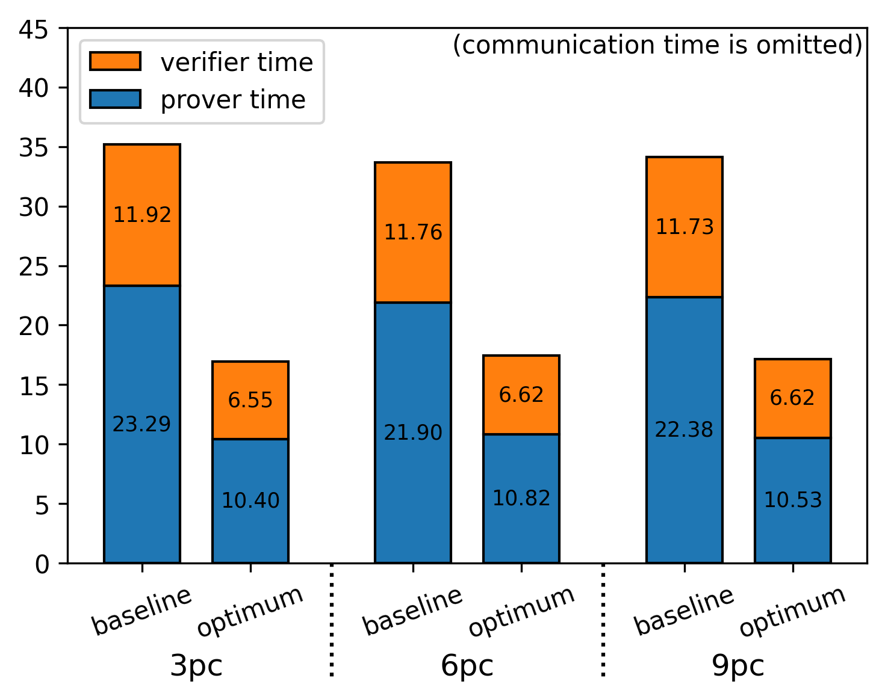
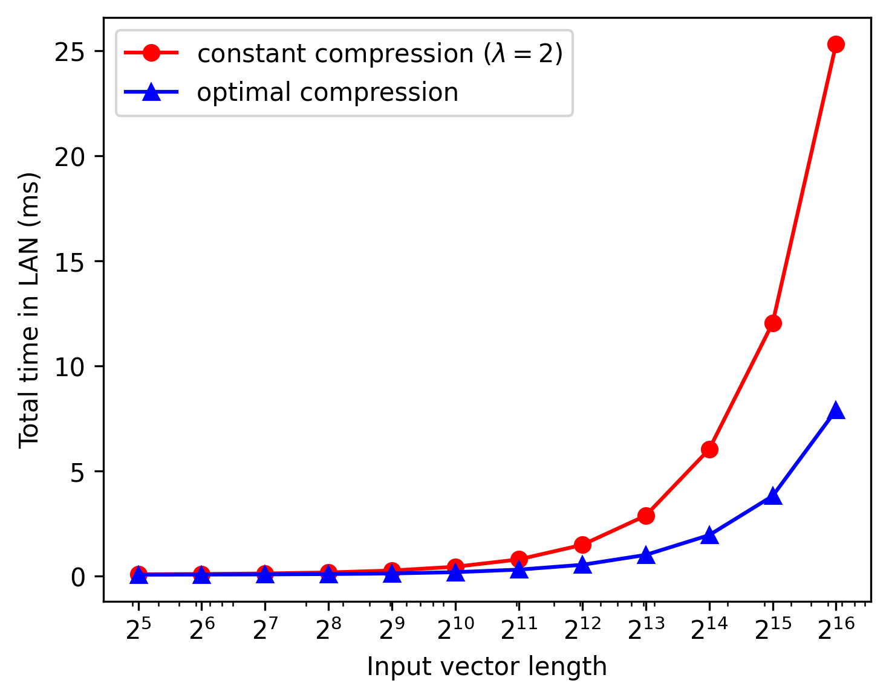
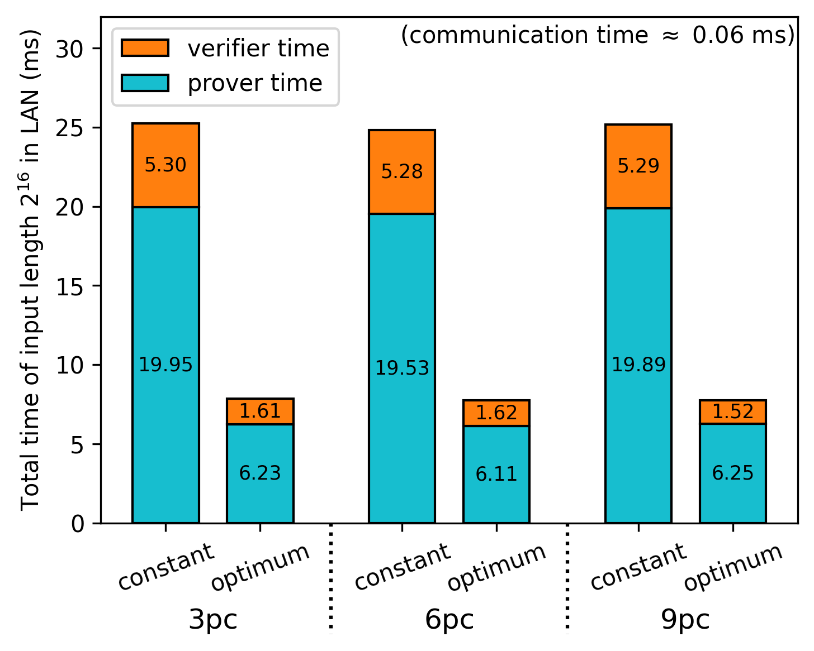
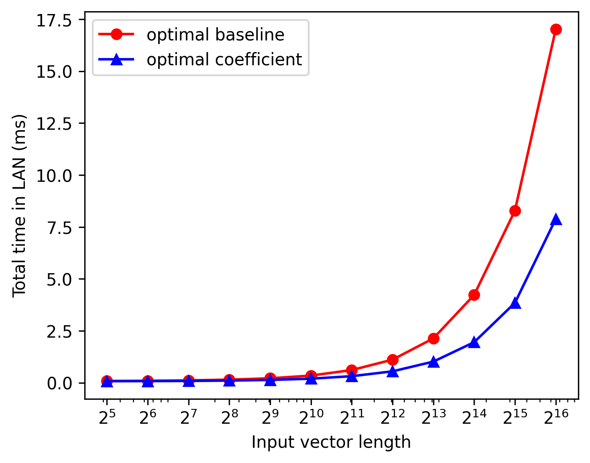

# Fully Linear PCP Simulator for Inner Product Circuits

This repository is the C++ implementation of the improved version of fully linear PCP for inner product circuit.
[Fully linear PCP (FLPCP)](https://eprint.iacr.org/2019/188.pdf) is zero-knowledge proof scheme which can be efficiently applied on distributed or secret-shared data by leveraging short linear proofs.

This project has been developed on Visual Studio CMake project and Windows 11 environment.

## Project Structure

* `circuit` - logic constructing proofs and queries of FLPCP and FLIOP.
* `experiments` - performance measurement of primitive modular operations, and simulation logic of 2PC, 3PC using FLPCP and FLIOP.
* `figure` - experiment result graphs and its poltting Python code.
* `math` - logic of primitive modular operations and polynomial interpolation.
* `unit` - class representing proof and query.

## Experiments

### Environment

* CPU: AMD Ryzen 9 7950X 16-Core Processor @ 5.00 GHz (Only used a single core)
* Memory: DDR5 32GB x2
* OS: Windows 11
* Compiler: MSVC C++

### Assumptions

* $Z_p$ : 61-bit Mersenne prime field
* Hashing mehtod : SHA512 (OpenSSL SHA512 implementation has been used.)
* LAN settings : 23Gbps bandwidth + 30 microsec. propagation delay
* WAN settings : 8Mbps bandwidth + 40 millisec. propagation delay
* Random seed : the fixed seed (23571113) was applied in all experiments.

### FLPCP Complexity

<div align="center">
  <table>
    <tr>
      <th> Prover Time </th>
      <th> Verifier Time </th>
      <th> Proof size </th>
    </tr>
    <tr>
      <td>  </td>
      <td>  </td>
      <td>  </td>
    </tr>
  </table>
</div>

### FLIOP Complexity

<div align="center">
  <table>
    <tr>
      <th> Prover Time </th>
      <th> Verifier Time </th>
      <th> Proof Size </th>
    </tr>
    <tr>
      <td>  </td>
      <td>  </td>
      <td>  </td>
    </tr>
  </table>
</div>

### Finding optimal schedules in FLIOP

<div align="center">
  <table>
    <tr>
      <th> Total Improvement of 3PC in LAN </th>
      <th> Improvement Proportion in LAN </th>
    </tr>
    <tr>
      <td>  </td>
      <td>  </td>
    </tr>
    <tr>
      <th> Total Improvement of 3PC in WAN </th>
      <th> Improvement Proportion in WAN </th>
    </tr>
    <tr>
      <td>  </td>
      <td>  </td>
    </tr>
  </table>
</div>

* Optimal schedules of FLIOP 3PC

```
LAN Min schedule
Length: 2 / Min time : 0.071145 / Best schedule : 2
Length: 4 / Min time : 0.072955648 / Best schedule : 4
Length: 8 / Min time : 0.074775125 / Best schedule : 3 3
Length: 16 / Min time : 0.077591819 / Best schedule : 6 3
Length: 32 / Min time : 0.084919643 / Best schedule : 11 3
Length: 64 / Min time : 0.093922426 / Best schedule : 5 5 3
Length: 128 / Min time : 0.111944685 / Best schedule : 8 6 3
Length: 256 / Min time : 0.146353032 / Best schedule : 6 5 3 3
Length: 512 / Min time : 0.213569726 / Best schedule : 6 6 5 3
Length: 1024 / Min time : 0.342897550 / Best schedule : 6 6 10 3
Length: 2048 / Min time : 0.610700333 / Best schedule : 5 6 5 5 3
Length: 4096 / Min time : 1.109722592 / Best schedule : 6 6 6 7 3
Length: 8192 / Min time : 2.133530939 / Best schedule : 5 6 5 5 4 3
Length: 16384 / Min time : 4.223953198 / Best schedule : 6 6 6 6 5 3
Length: 32768 / Min time : 8.283761546 / Best schedule : 5 5 6 5 5 3 3
Length: 65536 / Min time : 17.010978240 / Best schedule : 5 5 6 6 5 5 3

WAN Min schedule
Length: 2 / Min time : 80.023900000 / Best schedule : 2
Length: 4 / Min time : 80.028900000 / Best schedule : 4
Length: 8 / Min time : 80.036300000 / Best schedule : 3 3
Length: 16 / Min time : 80.043900000 / Best schedule : 6 3
Length: 32 / Min time : 80.055800000 / Best schedule : 4 3 3
Length: 64 / Min time : 80.069000000 / Best schedule : 5 5 3
Length: 128 / Min time : 80.093400000 / Best schedule : 8 6 3
Length: 256 / Min time : 80.130200000 / Best schedule : 6 5 3 3
Length: 512 / Min time : 80.202200000 / Best schedule : 6 6 5 3
Length: 1024 / Min time : 80.337800000 / Best schedule : 6 5 4 3 3
Length: 2048 / Min time : 80.608100000 / Best schedule : 5 6 5 5 3
Length: 4096 / Min time : 81.113500000 / Best schedule : 6 6 6 7 3
Length: 8192 / Min time : 82.139700000 / Best schedule : 5 6 5 5 4 3
Length: 16384 / Min time : 84.236500000 / Best schedule : 6 6 6 6 5 3
Length: 32768 / Min time : 88.298700000 / Best schedule : 5 5 6 5 5 3 3
Length: 65536 / Min time : 97.030700000 / Best schedule : 5 5 6 6 5 5 3
```

### Finding optimal schedules of coefficient version in FLIOP

<div align="center">
  <table>
    <tr>
      <th> Total Improvement of 3PC in LAN </th>
      <th> Improvement Proportion in LAN </th>
    </tr>
    <tr>
      <td>  </td>
      <td>  </td>
    </tr>
    <tr>
      <th> Total Improvement of 3PC in WAN </th>
      <th> Improvement Proportion in WAN </th>
    </tr>
    <tr>
      <td>  </td>
      <td>  </td>
    </tr>
  </table>
</div>

* Optimal schedules of FLIOP Coefficient 3PC

```
LAN Min schedule
Length: 2 / Min time : 0.065745 / Best schedule : 2
Length: 4 / Min time : 0.065655648 / Best schedule : 4
Length: 8 / Min time : 0.066277907 / Best schedule : 8
Length: 16 / Min time : 0.069422426 / Best schedule : 16
Length: 32 / Min time : 0.073508514 / Best schedule : 8 4
Length: 64 / Min time : 0.077530773 / Best schedule : 8 8
Length: 128 / Min time : 0.085669726 / Best schedule : 11 12
Length: 256 / Min time : 0.103719810 / Best schedule : 16 16
Length: 512 / Min time : 0.133894768 / Best schedule : 11 10 5
Length: 1024 / Min time : 0.194522592 / Best schedule : 11 11 9
Length: 2048 / Min time : 0.314167110 / Best schedule : 11 11 17
Length: 4096 / Min time : 0.547653198 / Best schedule : 11 11 9 4
Length: 8192 / Min time : 1.015775458 / Best schedule : 10 11 10 8
Length: 16384 / Min time : 1.949514411 / Best schedule : 9 11 14 12
Length: 32768 / Min time : 3.843481189 / Best schedule : 11 11 11 25
Length: 65536 / Min time : 7.879845018 / Best schedule : 13 13 10 10 4

WAN Min schedule
Length: 2 / Min time : 80.018500000 / Best schedule : 2
Length: 4 / Min time : 80.021600000 / Best schedule : 4
Length: 8 / Min time : 80.028600000 / Best schedule : 8
Length: 16 / Min time : 80.036800000 / Best schedule : 4 4
Length: 32 / Min time : 80.044600000 / Best schedule : 8 4
Length: 64 / Min time : 80.055000000 / Best schedule : 8 8
Length: 128 / Min time : 80.070000000 / Best schedule : 7 5 4
Length: 256 / Min time : 80.090700000 / Best schedule : 8 8 4
Length: 512 / Min time : 80.128200000 / Best schedule : 11 6 8
Length: 1024 / Min time : 80.194300000 / Best schedule : 9 6 5 4
Length: 2048 / Min time : 80.320700000 / Best schedule : 9 10 6 4
Length: 4096 / Min time : 80.557600000 / Best schedule : 11 9 6 7
Length: 8192 / Min time : 81.033100000 / Best schedule : 10 10 7 3 4
Length: 16384 / Min time : 81.970900000 / Best schedule : 9 11 7 5 5
Length: 32768 / Min time : 83.871000000 / Best schedule : 11 11 8 7 5
Length: 65536 / Min time : 87.916100000 / Best schedule : 13 11 11 6 7
```

### Comparing optimum of baseline and coefficient version in FLIOP 3PC

<div align="center">
  <table>
    <tr>
      <th> Total Improvement of 3PC in LAN </th>
      <th> Improvement Proportion in LAN </th>
    </tr>
    <tr>
      <td>  </td>
      <td>  </td>
    </tr>
    <tr>
      <th> Total Improvement of 3PC in WAN </th>
      <th> Improvement Proportion in WAN </th>
    </tr>
    <tr>
      <td>  </td>
      <td>  </td>
    </tr>
  </table>
</div>

## Reference

* Zero-Knowledge Proofs on Secret-Shared Data via Fully Linear PCPs (2019) [[PDF](https://eprint.iacr.org/2019/188.pdf)]
