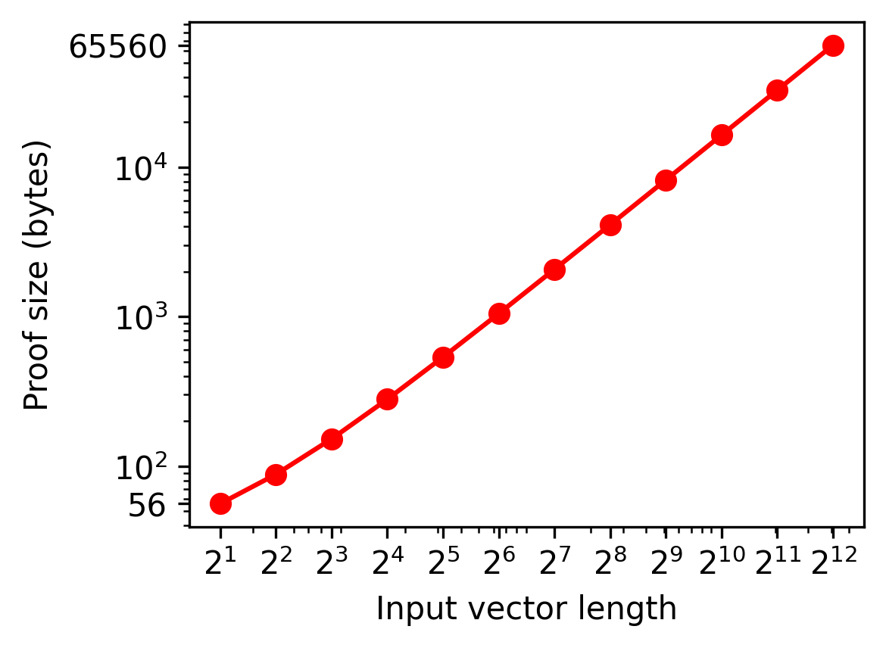
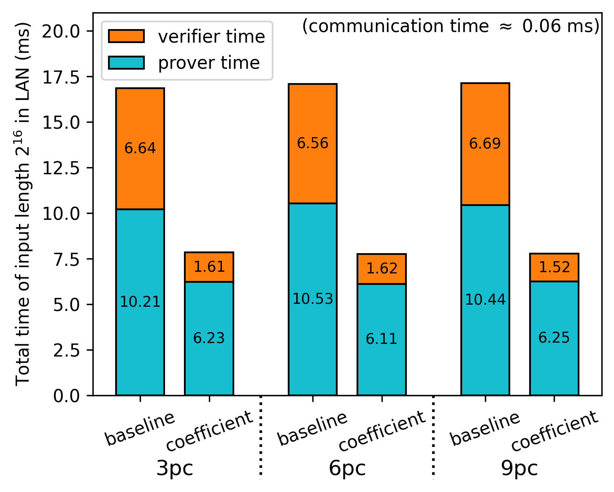
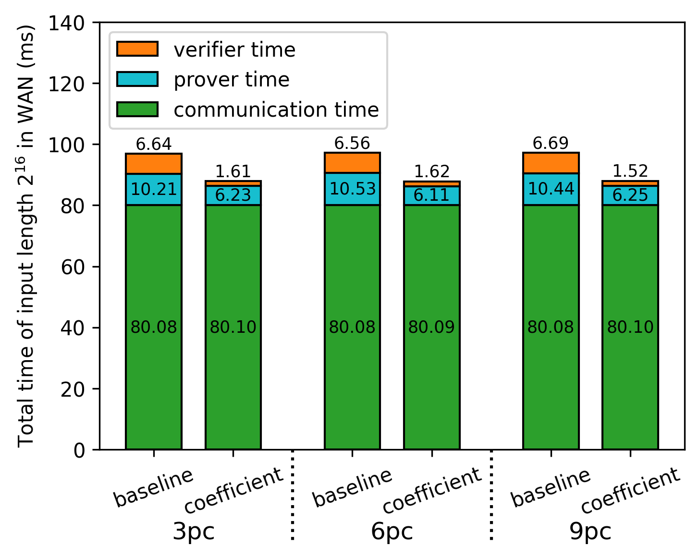

# Fully Linear PCP Simulator for Inner Product Circuits

This repository is the C++ implementation of the improved version of fully linear PCP for inner product circuit.
[Fully linear PCP (FLPCP)](https://eprint.iacr.org/2019/188.pdf) is zero-knowledge proof scheme which can be efficiently applied on distributed or secret-shared data by leveraging short linear proofs.

This project has been developed on Visual Studio CMake project and Windows 11 environment.

## Project Structure

* `circuit` - logic constructing proofs and queries of FLPCP and FLIOP.
* `experiments` - performance measurement of primitive modular operations, and simulation logic of 2PC, 3PC using FLPCP and FLIOP.
* `figure` - experiment result graphs and its poltting Python code.
* `math` - logic of primitive modular operations and polynomial interpolation.
* `unit` - class representing proof and query.

## Experiments

### Environment

* CPU: AMD Ryzen 9 7950X 16-Core Processor @ 5.00 GHz (Only used a single core)
* Memory: DDR5 32GB x2
* OS: Windows 11
* Compiler: MSVC C++

### Assumptions

* $Z_p$ : 61-bit Mersenne prime field
* Hashing mehtod : SHA512 (OpenSSL SHA512 implementation has been used.)
* LAN settings : 23Gbps bandwidth + 30 microsec. propagation delay
* WAN settings : 8Mbps bandwidth + 40 millisec. propagation delay
* Random seed : the fixed seed (23571113) was applied in all experiments.

### FLPCP Complexity

<div align="center">
  <table>
    <tr>
      <th> Prover Time </th>
      <th> Verifier Time </th>
      <th> Proof size </th>
    </tr>
    <tr>
      <td>  </td>
      <td>  </td>
      <td>  </td>
    </tr>
  </table>
</div>

### FLIOP Complexity

<div align="center">
  <table>
    <tr>
      <th> Prover Time </th>
      <th> Verifier Time </th>
      <th> Proof Size </th>
    </tr>
    <tr>
      <td>  </td>
      <td>  </td>
      <td>  </td>
    </tr>
  </table>
</div>

### Finding optimal schedules in FLIOP 2PC

* Total Improvement

<div align="center">
  <table>
    <tr>
      <th> Total Improvement in LAN </th>
      <th> Proportion in LAN </th>
    </tr>
    <tr>
      <td>  </td>
      <td>  </td>
    </tr>
    <tr>
      <th> Total Improvement in WAN </th>
      <th> Proportion in WAN </th>
    </tr>
    <tr>
      <td>  </td>
      <td>  </td>
    </tr>
  </table>
</div>

* Optimal schedule in LAN

```
Length: 32 / Min time : 0.043880690 / Best schedule : 6 3 2
Length: 64 / Min time : 0.049097384 / Best schedule : 5 7 2
Length: 128 / Min time : 0.060402949 / Best schedule : 5 4 4 2
Length: 256 / Min time : 0.080319643 / Best schedule : 6 5 5 2
Length: 512 / Min time : 0.121041902 / Best schedule : 6 6 8 2
Length: 1024 / Min time : 0.198241902 / Best schedule : 6 5 5 4 2
Length: 2048 / Min time : 0.353958597 / Best schedule : 6 7 5 5 2
Length: 4096 / Min time : 0.663364162 / Best schedule : 6 6 5 4 3 2
Length: 8192 / Min time : 1.282280856 / Best schedule : 6 6 6 5 4 2
Length: 16384 / Min time : 2.532403115 / Best schedule : 5 6 6 7 7 2
Length: 32768 / Min time : 5.052508680 / Best schedule : 6 6 6 6 4 4 2
Length: 65536 / Min time : 10.526725374 / Best schedule : 7 6 6 6 5 5 2
```

* Optimal schedule in WAN

```
Length: 32 / Min time : 40.037000000 / Best schedule : 6 3 2
Length: 64 / Min time : 40.044900000 / Best schedule : 4 4 2 2
Length: 128 / Min time : 40.059900000 / Best schedule : 5 4 4 2
Length: 256 / Min time : 40.084600000 / Best schedule : 6 5 5 2
Length: 512 / Min time : 40.127500000 / Best schedule : 6 5 3 3 2
Length: 1024 / Min time : 40.208900000 / Best schedule : 6 5 5 4 2
Length: 2048 / Min time : 40.369000000 / Best schedule : 6 5 3 4 3 2
Length: 4096 / Min time : 40.680400000 / Best schedule : 6 6 5 4 3 2
Length: 8192 / Min time : 41.303800000 / Best schedule : 6 6 5 4 3 2 2
Length: 16384 / Min time : 42.556300000 / Best schedule : 5 6 6 4 4 3 2
Length: 32768 / Min time : 45.081000000 / Best schedule : 6 6 6 5 4 4 2
Length: 65536 / Min time : 50.561000000 / Best schedule : 7 6 6 5 3 3 3 2
```

### Finding optimal schedules in FLIOP 3PC

<div align="center">
  <table>
    <tr>
      <th> Total Improvement in LAN </th>
      <th> Proportion in LAN </th>
    </tr>
    <tr>
      <td>  </td>
      <td>  </td>
    </tr>
    <tr>
      <th> Total Improvement in WAN </th>
      <th> Proportion in WAN </th>
    </tr>
    <tr>
      <td>  </td>
      <td>  </td>
    </tr>
  </table>
</div>

* Optimal schedule in LAN

```
Length: 32 / Min time : 0.053225208 / Best schedule : 8 2 2
Length: 64 / Min time : 0.063236338 / Best schedule : 6 6 2
Length: 128 / Min time : 0.081458597 / Best schedule : 8 8 2
Length: 256 / Min time : 0.116769726 / Best schedule : 6 5 5 2
Length: 512 / Min time : 0.183591986 / Best schedule : 6 7 7 2
Length: 1024 / Min time : 0.314208680 / Best schedule : 6 7 9 3 2
Length: 2048 / Min time : 0.573319810 / Best schedule : 5 5 6 7 2
Length: 4096 / Min time : 1.078947634 / Best schedule : 6 6 6 10 2
Length: 8192 / Min time : 2.099653198 / Best schedule : 5 5 6 5 6 2
Length: 16384 / Min time : 4.232875458 / Best schedule : 7 6 6 6 6 2
Length: 32768 / Min time : 8.434292152 / Best schedule : 5 6 6 7 9 3 2
Length: 65536 / Min time : 17.126997717 / Best schedule : 5 5 6 6 5 5 3 2
```

* Optimal schedule in WAN

```
Length: 32 / Min time : 40.057100000 / Best schedule : 4 4 2
Length: 64 / Min time : 40.071000000 / Best schedule : 6 4 3 2
Length: 128 / Min time : 40.096100000 / Best schedule : 7 7 3 2
Length: 256 / Min time : 40.135300000 / Best schedule : 6 5 3 3 2
Length: 512 / Min time : 40.207500000 / Best schedule : 5 6 6 3 2
Length: 1024 / Min time : 40.342800000 / Best schedule : 6 5 6 3 2
Length: 2048 / Min time : 40.604900000 / Best schedule : 5 5 5 6 3 2
Length: 4096 / Min time : 41.116800000 / Best schedule : 6 6 6 7 3 2
Length: 8192 / Min time : 42.140900000 / Best schedule : 5 5 6 5 4 3 2
Length: 16384 / Min time : 44.280500000 / Best schedule : 7 6 6 6 4 3 2
Length: 32768 / Min time : 48.486600000 / Best schedule : 5 6 5 5 4 4 3 2
Length: 65536 / Min time : 57.182300000 / Best schedule : 5 5 6 6 5 5 3 2
```

### Finding optimal schedules of coefficient version in FLIOP 3PC

<div align="center">
  <table>
    <tr>
      <th> Total Improvement in LAN </th>
      <th> Proportion in LAN </th>
    </tr>
    <tr>
      <td>  </td>
      <td>  </td>
    </tr>
    <tr>
      <th> Total Improvement in WAN </th>
      <th> Proportion in WAN </th>
    </tr>
    <tr>
      <td>  </td>
      <td>  </td>
    </tr>
  </table>
</div>

* Optimal schedule in LAN

```
Length: 32 / Min time : 0.043014078 / Best schedule : 5 7 2
Length: 64 / Min time : 0.047236338 / Best schedule : 8 8 2
Length: 128 / Min time : 0.055975291 / Best schedule : 11 12 2
Length: 256 / Min time : 0.072730939 / Best schedule : 13 20 2
Length: 512 / Min time : 0.103497550 / Best schedule : 9 9 7 2
Length: 1024 / Min time : 0.165036504 / Best schedule : 10 15 7 2
Length: 2048 / Min time : 0.284275458 / Best schedule : 11 11 17 2
Length: 4096 / Min time : 0.518258763 / Best schedule : 11 11 6 6 2
Length: 8192 / Min time : 0.993886587 / Best schedule : 12 10 10 7 2
Length: 16384 / Min time : 1.923125541 / Best schedule : 11 11 10 14 2
Length: 32768 / Min time : 3.787831106 / Best schedule : 11 11 11 9 3 2
Length: 65536 / Min time : 8.169342235 / Best schedule : 10 11 11 8 7 2
```

* Optimal schedule in WAN

```
Length: 32 / Min time : 40.045700000 / Best schedule : 5 7 2
Length: 64 / Min time : 40.056300000 / Best schedule : 8 8 2
Length: 128 / Min time : 40.071600000 / Best schedule : 8 4 4 2
Length: 256 / Min time : 40.092500000 / Best schedule : 8 5 7 2
Length: 512 / Min time : 40.130100000 / Best schedule : 9 9 7 2
Length: 1024 / Min time : 40.198200000 / Best schedule : 10 7 5 3 2
Length: 2048 / Min time : 40.322300000 / Best schedule : 10 7 5 6 2
Length: 4096 / Min time : 40.561600000 / Best schedule : 11 9 7 6 2
Length: 8192 / Min time : 41.046000000 / Best schedule : 12 10 10 7 2
Length: 16384 / Min time : 41.980800000 / Best schedule : 11 11 7 5 4 2
Length: 32768 / Min time : 43.848800000 / Best schedule : 11 11 8 6 6 2
Length: 65536 / Min time : 48.237400000 / Best schedule : 10 11 11 8 7 2
```

### Comparing optimum of baseline and coefficient version in FLIOP 3PC

<div align="center">
  <table>
    <tr>
      <th> Total Improvement in LAN </th>
      <th> Proportion in LAN </th>
    </tr>
    <tr>
      <td>  </td>
      <td>  </td>
    </tr>
    <tr>
      <th> Total Improvement in WAN </th>
      <th> Proportion in WAN </th>
    </tr>
    <tr>
      <td>  </td>
      <td>  </td>
    </tr>
  </table>
</div>

## Reference

* Zero-Knowledge Proofs on Secret-Shared Data via Fully Linear PCPs (2019) [[PDF](https://eprint.iacr.org/2019/188.pdf)]
