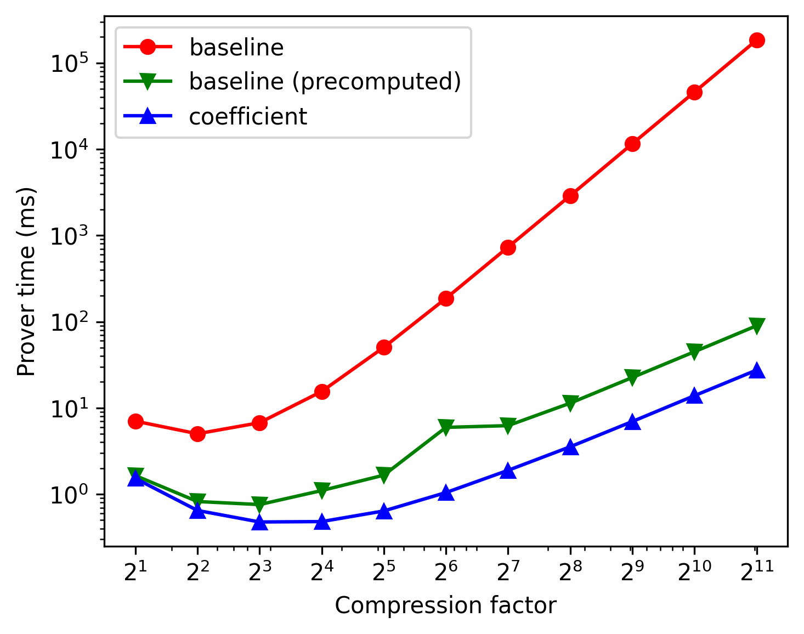

# Fully Linear PCP Simulator for Inner Product Circuits

This repository is the C++ implementation of the improved version of fully linear PCP for inner product circuit.
[Fully linear PCP (FLPCP)](https://eprint.iacr.org/2019/188.pdf) is zero-knowledge proof scheme which can be efficiently applied on distributed or secret-shared data by leveraging short linear proofs.

This project has been developed on Visual Studio CMake project and Windows 11 environment.

## Project Structure

* `circuit` - logic constructing proofs and queries of FLPCP and FLIOP.
* `experiments` - performance measurement of primitive modular operations, and simulation logic of 2PC, 3PC using FLPCP and FLIOP.
* `figure` - experiment result graphs and its poltting Python code.
* `math` - logic of primitive modular operations and polynomial interpolation.
* `unit` - class representing proof and query.
* `win-x64-release` - complied executable files for x64 windows environment.

## Experiment Environment

* CPU: AMD Ryzen 9 7950X 16-Core Processor @ 5.00 GHz (Only used a single core)
* Memory: DDR5 32GB x2

## FLPCP Complexity over $\mathbb Z_{2^{61}-1}$

### Baseline

<div align="center">
  <table>
    <tr>
      <th> Proof Size: $O(N)$ </th>
      <th> Query Complexity: $O(1)$ </th>
    </tr>
    <tr>
      <td>  </td>
      <td>  </td>
    </tr>
    <tr>
      <th> Prover Time: $O(N^3)$ </th>
      <th> Verifier Time: $O(N^2)$ </th>
    </tr>
    <tr>
      <td>  </td>
      <td>  </td>
    </tr>
  </table>
</div>

### Coefficient Baseline

<div align="center">
  <table>
    <tr>
      <th> Proof Size: $O(N)$ </th>
      <th> Query Complexity: $O(1)$ </th>
    </tr>
    <tr>
      <td>  </td>
      <td>  </td>
    </tr>
    <tr>
      <th> Prover Time: $O(N^2)$ </th>
      <th> Verifier Time: $O(N)$ </th>
    </tr>
    <tr>
      <td>  </td>
      <td>  </td>
    </tr>
  </table>
</div>

### $\sqrt{N}$ Optimized version

<div align="center">
  <table>
    <tr>
      <th> Proof Size: $O(\sqrt{N})$ </th>
      <th> Query Complexity: $O(\sqrt{N})$ </th>
    </tr>
    <tr>
      <td>  </td>
      <td>  </td>
    </tr>
    <tr>
      <th> Prover Time: $O(N^2)$ </th>
      <th> Verifier Time: $O(N\sqrt{N})$ </th>
    </tr>
    <tr>
      <td>  </td>
      <td>  </td>
    </tr>
  </table>
</div>

### Coefficient + $\sqrt{N}$ Optimized version

<div align="center">
  <table>
    <tr>
      <th> Proof Size: $O(\sqrt{N})$ </th>
      <th> Query Complexity: $O(\sqrt{N})$ </th>
    </tr>
    <tr>
      <td>  </td>
      <td>  </td>
    </tr>
    <tr>
      <th> Prover Time: $O(N\sqrt{N})$ </th>
      <th> Verifier Time: $O(N\sqrt{N})$ </th>
    </tr>
    <tr>
      <td>  </td>
      <td>  </td>
    </tr>
  </table>
</div>

### Comparison

<div align="center">
  <table>
    <tr>
      <th> Proof Size </th>
      <th> Query Complexity </th>
    </tr>
    <tr>
      <td>  </td>
      <td>  </td>
    </tr>
    <tr>
      <th> Prover Time </th>
      <th> Verifier Time </th>
    </tr>
    <tr>
      <td>  </td>
      <td>  </td>
    </tr>
  </table>
</div>

## FLIOP Complexity over $\mathbb Z_{2^{61}-1}$

### Baseline vs Baseline with random oracle

<div align="center">
  <table>
    <tr>
      <th> Proof Size: $O(\log_2{N})$ </th>
      <th> Query Complexity: $O(\log_2{N})$ </th>
    </tr>
    <tr>
      <td>  </td>
      <td>  </td>
    </tr>
    <tr>
      <th> Prover Time: $O(N)$ </th>
      <th> Verifier Time </th>
    </tr>
    <tr>
      <td>  </td>
      <td>  </td>
    </tr>
    <tr>
      <th> LAN Delay </th>
      <th> WAN Delay </th>
    </tr>
    <tr>
      <td>  </td>
      <td>  </td>
    </tr>
  </table>
</div>

### Coefficient version vs Coefficient with random oracle

<div align="center">
  <table>
    <tr>
      <th> Proof Size: $O(\log_2{N})$ </th>
      <th> Query Complexity: $O(\log_2{N})$ </th>
    </tr>
    <tr>
      <td>  </td>
      <td>  </td>
    </tr>
    <tr>
      <th> Prover Time: $O(N)$ </th>
      <th> Verifier Time </th>
    </tr>
    <tr>
      <td>  </td>
      <td>  </td>
    </tr>
    <tr>
      <th> LAN Delay </th>
      <th> WAN Delay </th>
    </tr>
    <tr>
      <td>  </td>
      <td>  </td>
    </tr>
  </table>
</div>
    

### Comparison

<div align="center">
  <table>
    <tr>
      <th> Prover Time </th>
      <th> Verifier Time </th>
    </tr>
    <tr>
      <td>  </td>
      <td>  </td>
    </tr>
  </table>
</div>

## Network Simulation on 3PC

<div align="center">
  <table>
    <tr>
      <th> LAN </th>
      <th> WAN </th>
    </tr>
    <tr>
      <td>  </td>
      <td>  </td>
    </tr>
  </table>
</div>

### LAN

```
FLIOP LAN Min schedule
Length: 2 / Min time : 0.166800 / Best schedule : 2
Length: 4 / Min time : 0.354660000 / Best schedule : 2 2
Length: 8 / Min time : 0.359740000 / Best schedule : 4 2
Length: 16 / Min time : 0.380000000 / Best schedule : 8 2
Length: 32 / Min time : 0.491220000 / Best schedule : 16 2
Length: 64 / Min time : 0.609540000 / Best schedule : 4 8 2
Length: 128 / Min time : 0.718040000 / Best schedule : 6 11 2
Length: 256 / Min time : 0.963380000 / Best schedule : 4 4 8 2
Length: 512 / Min time : 1.236580000 / Best schedule : 4 6 11 2
Length: 1024 / Min time : 1.841060000 / Best schedule : 3 4 5 9 2

FLIOP Coeff. LAN Min schedule
Length: 2 / Min time : 0.164100 / Best schedule : 2
Length: 4 / Min time : 0.350260000 / Best schedule : 2 2
Length: 8 / Min time : 0.352240000 / Best schedule : 4 2
Length: 16 / Min time : 0.357400000 / Best schedule : 8 2
Length: 32 / Min time : 0.367720000 / Best schedule : 16 2
Length: 64 / Min time : 0.389260000 / Best schedule : 32 2
Length: 128 / Min time : 0.558400000 / Best schedule : 8 8 2
Length: 256 / Min time : 0.576580000 / Best schedule : 13 10 2
Length: 512 / Min time : 0.609440000 / Best schedule : 16 16 2
Length: 1024 / Min time : 0.673580000 / Best schedule : 16 32 2

FLIOP LAN Delay (When the compression factor is fixed to 2)
Length: 2 / Time : 0.166800000
Length: 4 / Time : 0.354660000
Length: 8 / Time : 0.544520000
Length: 16 / Time : 0.739780000
Length: 32 / Time : 0.943640000
Length: 64 / Time : 1.166100000
Length: 128 / Time : 1.423460000
Length: 256 / Time : 1.752320000
Length: 512 / Time : 2.230880000
Length: 1024 / Time : 3.005640000

FLIOP Coeff. LAN Delay (When the compression factor is fixed to 2)
Length: 2 / Time : 0.164100000
Length: 4 / Time : 0.350260000
Length: 8 / Time : 0.536920000
Length: 16 / Time : 0.725280000
Length: 32 / Time : 0.915340000
Length: 64 / Time : 1.109900000
Length: 128 / Time : 1.313360000
Length: 256 / Time : 1.535720000
Length: 512 / Time : 1.795980000
Length: 1024 / Time : 2.127540000
```

### WAN

```
FLIOP WAN Min schedule
Length: 2 / Min time : 210.209000000 / Best schedule : 2
Length: 4 / Min time : 455.652700000 / Best schedule : 2 2
Length: 8 / Min time : 458.375700000 / Best schedule : 4 2
Length: 16 / Min time : 463.831800000 / Best schedule : 8 2
Length: 32 / Min time : 474.814700000 / Best schedule : 16 2
Length: 64 / Min time : 497.355500000 / Best schedule : 32 2
Length: 128 / Min time : 717.596300000 / Best schedule : 8 8 2
Length: 256 / Min time : 727.479900000 / Best schedule : 10 13 2
Length: 512 / Min time : 741.256800000 / Best schedule : 16 16 2
Length: 1024 / Min time : 764.175700000 / Best schedule : 19 27 2

FLIOP Coeff. WAN Min schedule
Length: 2 / Min time : 210.206300000 / Best schedule : 2
Length: 4 / Min time : 455.648300000 / Best schedule : 2 2
Length: 8 / Min time : 458.368200000 / Best schedule : 4 2
Length: 16 / Min time : 463.809200000 / Best schedule : 8 2
Length: 32 / Min time : 474.691200000 / Best schedule : 16 2
Length: 64 / Min time : 496.456100000 / Best schedule : 32 2
Length: 128 / Min time : 717.419800000 / Best schedule : 8 8 2
Length: 256 / Min time : 726.950700000 / Best schedule : 13 10 2
Length: 512 / Min time : 739.214200000 / Best schedule : 16 16 2
Length: 1024 / Min time : 758.305600000 / Best schedule : 19 27 2

FLIOP WAN Delay (When the compression factor is fixed to 2)
Length: 2 / Time : 210.209000000
Length: 4 / Time : 455.652700000
Length: 8 / Time : 701.098400000
Length: 16 / Time : 946.549500000
Length: 32 / Time : 1192.009200000
Length: 64 / Time : 1437.487500000
Length: 128 / Time : 1683.000700000
Length: 256 / Time : 1928.585400000
Length: 512 / Time : 2174.319800000
Length: 1024 / Time : 2420.350400000

FLIOP Coeff. WAN Delay (When the compression factor is fixed to 2)
Length: 2 / Time : 210.206300000
Length: 4 / Time : 455.648300000
Length: 8 / Time : 701.090800000
Length: 16 / Time : 946.535000000
Length: 32 / Time : 1191.980900000
Length: 64 / Time : 1437.431300000
Length: 128 / Time : 1682.890600000
Length: 256 / Time : 1928.368800000
Length: 512 / Time : 2173.884900000
Length: 1024 / Time : 2419.472300000
```

## Network Simulation on 3PC (Precomputed Vandermonde matrix + Random oracle)

<div align="center">
  <table>
    <tr>
      <th> LAN </th>
      <th> WAN </th>
    </tr>
    <tr>
      <td>  </td>
      <td>  </td>
    </tr>
  </table>
</div>

### LAN

```
LAN Min schedule
Length: 2 / Min time : 0.090120 / Best schedule : 2
Length: 4 / Min time : 0.100400000 / Best schedule : 2 2
Length: 8 / Min time : 0.105660000 / Best schedule : 4 2
Length: 16 / Min time : 0.116680000 / Best schedule : 8 2
Length: 32 / Min time : 0.125200000 / Best schedule : 4 4 2
Length: 64 / Min time : 0.141020000 / Best schedule : 8 4 2
Length: 128 / Min time : 0.160440000 / Best schedule : 4 4 4 2
Length: 256 / Min time : 0.195360000 / Best schedule : 6 6 4 2
Length: 512 / Min time : 0.254560000 / Best schedule : 6 5 3 3 2
Length: 1024 / Min time : 0.364500000 / Best schedule : 6 6 5 3 2

Coeff. LAN Min schedule
Length: 2 / Min time : 0.080220000 / Best schedule : 2
Length: 4 / Min time : 0.090700000 / Best schedule : 2 2
Length: 8 / Min time : 0.095860000 / Best schedule : 4 2
Length: 16 / Min time : 0.104880000 / Best schedule : 8 2
Length: 32 / Min time : 0.114000000 / Best schedule : 4 4 2
Length: 64 / Min time : 0.124720000 / Best schedule : 8 4 2
Length: 128 / Min time : 0.139540000 / Best schedule : 8 8 2
Length: 256 / Min time : 0.161060000 / Best schedule : 8 4 4 2
Length: 512 / Min time : 0.195280000 / Best schedule : 9 6 5 2
Length: 1024 / Min time : 0.259080000 / Best schedule : 11 8 6 2

FLIOP LAN Delay (When the compression factor is fixed to 2)
Length: 2 / Time : 0.090120000
Length: 4 / Time : 0.100400000
Length: 8 / Time : 0.111180000
Length: 16 / Time : 0.123860000
Length: 32 / Time : 0.139440000
Length: 64 / Time : 0.160920000
Length: 128 / Time : 0.195400000
Length: 256 / Time : 0.254180000
Length: 512 / Time : 0.363860000
Length: 1024 / Time : 0.586840000

FLIOP Coeff. LAN Delay (When the compression factor is fixed to 2)
Length: 2 / Time : 0.080220000
Length: 4 / Time : 0.090700000
Length: 8 / Time : 0.101880000
Length: 16 / Time : 0.113960000
Length: 32 / Time : 0.128640000
Length: 64 / Time : 0.148120000
Length: 128 / Time : 0.177400000
Length: 256 / Time : 0.226780000
Length: 512 / Time : 0.320460000
Length: 1024 / Time : 0.502940000
```

### WAN

```
WAN Min schedule
Length: 2 / Min time : 97.696600000 / Best schedule : 2
Length: 4 / Min time : 107.219600000 / Best schedule : 2 2
Length: 8 / Min time : 112.660700000 / Best schedule : 4 2
Length: 16 / Min time : 122.185000000 / Best schedule : 4 2 2
Length: 32 / Min time : 127.628800000 / Best schedule : 4 4 2
Length: 64 / Min time : 137.158200000 / Best schedule : 4 4 2 2
Length: 128 / Min time : 142.612600000 / Best schedule : 4 4 4 2
Length: 256 / Min time : 152.162700000 / Best schedule : 4 4 4 2 2
Length: 512 / Min time : 157.669100000 / Best schedule : 4 4 4 4 2
Length: 1024 / Min time : 167.283900000 / Best schedule : 5 4 3 3 3 2

Coeff. WAN Min schedule
Length: 2 / Min time : 97.686700000 / Best schedule : 2
Length: 4 / Min time : 107.209900000 / Best schedule : 2 2
Length: 8 / Min time : 112.650900000 / Best schedule : 4 2
Length: 16 / Min time : 122.174700000 / Best schedule : 3 3 2
Length: 32 / Min time : 127.617600000 / Best schedule : 4 4 2
Length: 64 / Min time : 137.144600000 / Best schedule : 4 3 3 2
Length: 128 / Min time : 142.594400000 / Best schedule : 4 4 4 2
Length: 256 / Min time : 152.133900000 / Best schedule : 5 3 3 3 2
Length: 512 / Min time : 157.613100000 / Best schedule : 4 4 4 4 2
Length: 1024 / Min time : 167.203200000 / Best schedule : 5 4 3 3 3 2

FLIOP WAN Delay (When the compression factor is fixed to 2)
Length: 2 / Time : 97.696600000
Length: 4 / Time : 107.219600000
Length: 8 / Time : 116.743100000
Length: 16 / Time : 126.268500000
Length: 32 / Time : 135.796800000
Length: 64 / Time : 145.331000000
Length: 128 / Time : 154.878200000
Length: 256 / Time : 164.449700000
Length: 512 / Time : 174.072100000
Length: 1024 / Time : 183.807800000

FLIOP Coeff. WAN Delay (When the compression factor is fixed to 2)
Length: 2 / Time : 97.686700000
Length: 4 / Time : 107.209900000
Length: 8 / Time : 116.733800000
Length: 16 / Time : 126.258600000
Length: 32 / Time : 135.786000000
Length: 64 / Time : 145.318200000
Length: 128 / Time : 154.860200000
Length: 256 / Time : 164.422300000
Length: 512 / Time : 174.028700000
Length: 1024 / Time : 183.723900000
```

## Reference

* Zero-Knowledge Proofs on Secret-Shared Data via Fully Linear PCPs (2019) [[PDF](https://eprint.iacr.org/2019/188.pdf)]
