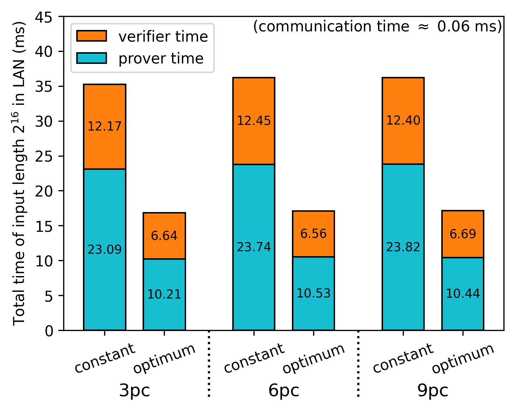
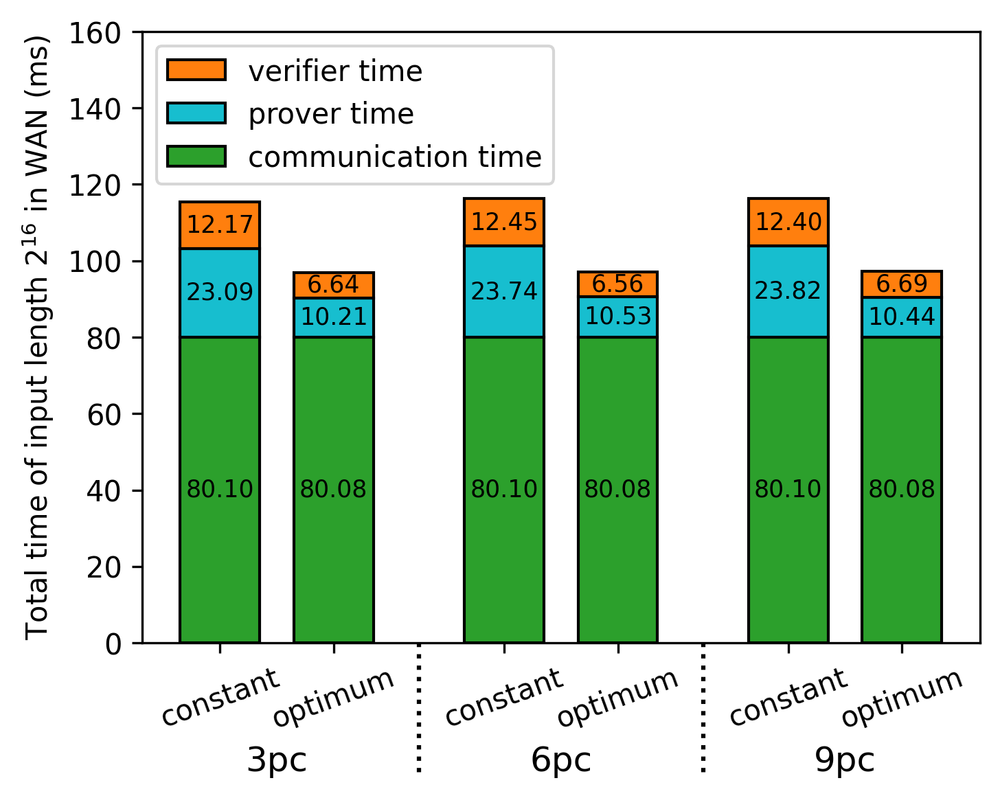
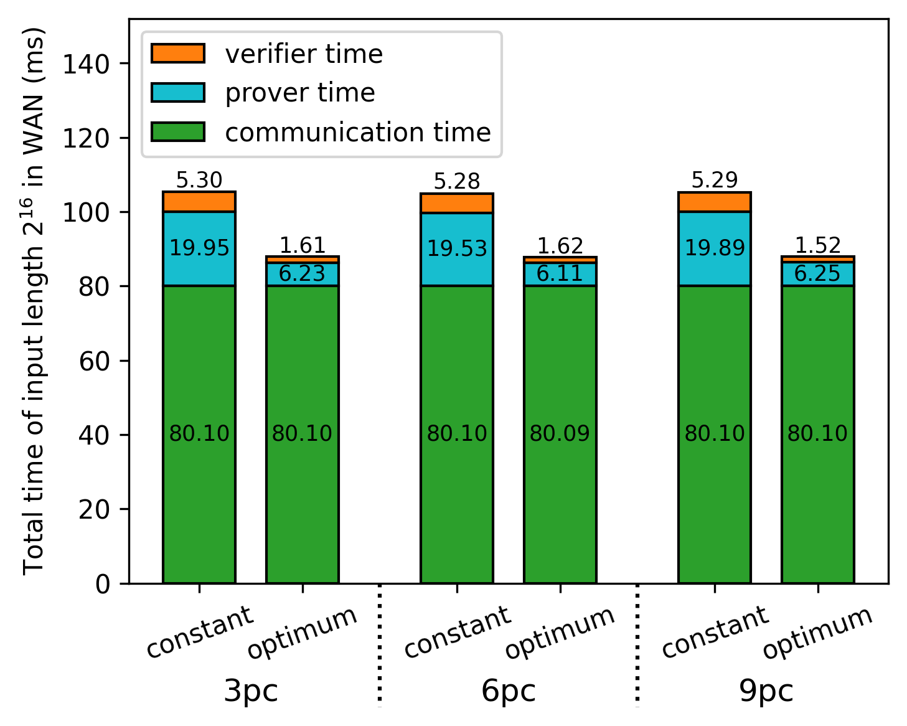

# Fully Linear PCP Simulator for Inner Product Circuits

This repository is the C++ implementation of the improved version of fully linear PCP for inner product circuit.
[Fully linear PCP (FLPCP)](https://eprint.iacr.org/2019/188.pdf) is zero-knowledge proof scheme which can be efficiently applied on distributed or secret-shared data by leveraging short linear proofs.

This project has been developed on Visual Studio CMake project and Windows 11 environment.

## Project Structure

* `circuit` - logic constructing proofs and queries of FLPCP and FLIOP.
* `experiments` - performance measurement of primitive modular operations, and simulation logic of 2PC, 3PC using FLPCP and FLIOP.
* `figure` - experiment result graphs and its poltting Python code.
* `math` - logic of primitive modular operations and polynomial interpolation.
* `unit` - class representing proof and query.

## Experiments

### Environment

* CPU: AMD Ryzen 9 7950X 16-Core Processor @ 5.00 GHz (Only used a single core)
* Memory: DDR5 32GB x2
* OS: Windows 11
* Compiler: MSVC C++

### Assumptions

* $Z_p$ : 61-bit Mersenne prime field
* Hashing mehtod : SHA512 (OpenSSL SHA512 implementation has been used.)
* LAN settings : 23Gbps bandwidth + 30 microsec. propagation delay
* WAN settings : 8Mbps bandwidth + 40 millisec. propagation delay
* Random seed : the fixed seed (23571113) was applied in all experiments.

### FLPCP Complexity

<div align="center">
  <table>
    <tr>
      <th> Prover Time </th>
      <th> Verifier Time </th>
    </tr>
    <tr>
      <td>  </td>
      <td>  </td>
    </tr>
  </table>
</div>

<div align="center" style="width: 33%">
  <table>
    <tr>
      <th> Proof size </th>
    </tr>
    <tr>
      <td>  </td>
    </tr>
  </table>
</div>

### FLIOP Complexity

<div align="center">
  <table>
    <tr>
      <th> Prover Time </th>
      <th> Verifier Time </th>
    </tr>
    <tr>
      <td>  </td>
      <td>  </td>
    </tr>
  </table>
</div>

<div align="center">
  <table>
    <tr>
      <th> Proof Size </th>
      <th> LAN Time </th>
      <th> WAN Time </th>
    </tr>
    <tr>
      <td>  </td>
      <td>  </td>
      <td>  </td>
    </tr>
  </table>
</div>

### Finding optimal schedules in FLIOP

<div align="center">
  <table>
    <tr>
      <th> Total Improvement of 3PC in LAN </th>
      <th> Total Payload Size of 3PC in LAN </th>
      <th> Improvement Proportion in LAN </th>
    </tr>
    <tr>
      <td>  </td>
      <td>  </td>
      <td>  </td>
    </tr>
    <tr>
      <th> Total Improvement of 3PC in WAN </th>
      <th> Total Payload Size of 3PC in WAN </th>
      <th> Improvement Proportion in WAN </th>
    </tr>
    <tr>
      <td>  </td>
      <td>  </td>
      <td>  </td>
    </tr>
  </table>
</div>

* Optimal schedules of FLIOP 3PC (some part of log)

```
[Optimal Schedules]
* LAN Min schedule
Length: 2 / Min time : 0.067145 / Best schedule : 2
Length: 4 / Min time : 0.0703 / Best schedule : 2 2
Length: 8 / Min time : 0.0725 / Best schedule : 4 2
Length: 16 / Min time : 0.0761 / Best schedule : 9 2
Length: 32 / Min time : 0.0814 / Best schedule : 8 2 2
Length: 64 / Min time : 0.0908 / Best schedule : 5 7 2
Length: 128 / Min time : 0.1098 / Best schedule : 6 11 2
Length: 256 / Min time : 0.1434 / Best schedule : 6 5 5 2
Length: 512 / Min time : 0.2091 / Best schedule : 6 6 8 2
Length: 1024 / Min time : 0.3409 / Best schedule : 5 6 5 4 2
Length: 2048 / Min time : 0.5946 / Best schedule : 5 5 6 7 2
Length: 4096 / Min time : 1.1032 / Best schedule : 6 6 5 8 3
Length: 8192 / Min time : 2.1291 / Best schedule : 6 5 5 4 7 2
Length: 16384 / Min time : 4.1517 / Best schedule : 5 5 6 5 11 2
Length: 32768 / Min time : 8.4775 / Best schedule : 7 6 6 7 10 2
Length: 65536 / Min time : 16.9121 / Best schedule : 7 6 5 7 5 5 2
Total: 0.0671, 0.0703, 0.0725, 0.0761, 0.0814, 0.0908, 0.1098, 0.1434, 0.2091, 0.3409, 0.5946, 1.1032, 2.1291, 4.1517, 8.4775, 16.9121,
Prover: 0.0027, 0.0046, 0.0058, 0.0076, 0.0111, 0.0173, 0.0280, 0.0487, 0.0887, 0.1706, 0.3268, 0.6324, 1.2558, 2.4973, 5.0881, 10.2084,
Verifier: 0.0044, 0.0056, 0.0066, 0.0084, 0.0102, 0.0134, 0.0216, 0.0345, 0.0602, 0.1101, 0.2076, 0.4106, 0.8131, 1.5941, 3.3291, 6.6434,
Communication: 0.0600, 0.0601, 0.0601, 0.0601, 0.0601, 0.0601, 0.0602, 0.0602, 0.0602, 0.0602, 0.0602, 0.0602, 0.0602, 0.0603, 0.0603, 0.0603,
Payload: 128, 184, 216, 296, 336, 368, 448, 456, 520, 544, 592, 640, 680, 760, 824, 832,

* WAN Min schedule
Length: 2 / Min time : 80.0199 / Best schedule : 2
Length: 4 / Min time : 80.0285 / Best schedule : 4
Length: 8 / Min time : 80.0340 / Best schedule : 4 2
Length: 16 / Min time : 80.0430 / Best schedule : 6 3
Length: 32 / Min time : 80.0518 / Best schedule : 4 4 2
Length: 64 / Min time : 80.0671 / Best schedule : 5 5 3
Length: 128 / Min time : 80.0895 / Best schedule : 4 4 4 2
Length: 256 / Min time : 80.1281 / Best schedule : 6 5 3 3
Length: 512 / Min time : 80.1985 / Best schedule : 6 6 5 3
Length: 1024 / Min time : 80.3351 / Best schedule : 5 6 5 4 2
Length: 2048 / Min time : 80.5933 / Best schedule : 5 5 6 5 3
Length: 4096 / Min time : 81.1069 / Best schedule : 6 6 5 4 3 2
Length: 8192 / Min time : 82.1366 / Best schedule : 6 5 5 4 5 3
Length: 16384 / Min time : 84.1646 / Best schedule : 5 5 6 5 4 3 2
Length: 32768 / Min time : 88.4968 / Best schedule : 7 6 6 7 7 3
Length: 65536 / Min time : 96.9343 / Best schedule : 7 6 5 7 5 3 3
Total: 80.0199, 80.0285, 80.0340, 80.0430, 80.0518, 80.0671, 80.0895, 80.1281, 80.1985, 80.3351, 80.5933, 81.1069, 82.1366, 84.1646, 88.4968, 96.9343,
Prover: 0.0027, 0.0031, 0.0058, 0.0071, 0.0114, 0.0167, 0.0294, 0.0483, 0.0881, 0.1706, 0.3263, 0.6344, 1.2553, 2.4985, 5.0875, 10.2080,
Verifier: 0.0044, 0.0094, 0.0066, 0.0095, 0.0100, 0.0152, 0.0209, 0.0358, 0.0616, 0.1101, 0.2094, 0.4093, 0.8149, 1.5941, 3.3301, 6.6447,
Communication: 80.0128, 80.0160, 80.0216, 80.0264, 80.0304, 80.0352, 80.0392, 80.0440, 80.0488, 80.0544, 80.0576, 80.0632, 80.0664, 80.0720, 80.0792, 80.0816,
Payload: 128, 160, 216, 264, 304, 352, 392, 440, 488, 544, 576, 632, 664, 720, 792, 816,
```

### Finding optimal schedules of coefficient version in FLIOP

<div align="center">
  <table>
    <tr>
      <th> Total Improvement of 3PC in LAN </th>
      <th> Total Payload Size of 3PC in LAN </th>
      <th> Improvement Proportion in LAN </th>
    </tr>
    <tr>
      <td>  </td>
      <td>  </td>
      <td>  </td>
    </tr>
    <tr>
      <th> Total Improvement of 3PC in WAN </th>
      <th> Total Payload Size of 3PC in WAN </th>
      <th> Improvement Proportion in WAN </th>
    </tr>
    <tr>
      <td>  </td>
      <td>  </td>
      <td>  </td>
    </tr>
  </table>
</div>

* Optimal schedules of FLIOP Coefficient 3PC (some part of log)

```
[Optimal Schedules]
* LAN Min schedule
Length: 2 / Min time : 0.068245 / Best schedule : 2
Length: 4 / Min time : 0.0654 / Best schedule : 4
Length: 8 / Min time : 0.0662 / Best schedule : 8
Length: 16 / Min time : 0.0691 / Best schedule : 16
Length: 32 / Min time : 0.0731 / Best schedule : 11 3
Length: 64 / Min time : 0.0768 / Best schedule : 10 7
Length: 128 / Min time : 0.0842 / Best schedule : 11 12
Length: 256 / Min time : 0.1020 / Best schedule : 13 20
Length: 512 / Min time : 0.1314 / Best schedule : 11 10 5
Length: 1024 / Min time : 0.1923 / Best schedule : 11 11 9
Length: 2048 / Min time : 0.3132 / Best schedule : 10 10 21
Length: 4096 / Min time : 0.5426 / Best schedule : 11 11 5 7
Length: 8192 / Min time : 1.0127 / Best schedule : 11 9 10 9
Length: 16384 / Min time : 1.9534 / Best schedule : 11 11 10 14
Length: 32768 / Min time : 3.8155 / Best schedule : 11 11 11 25
Length: 65536 / Min time : 7.8995 / Best schedule : 13 11 9 8 7
Total: 0.0682, 0.0654, 0.0662, 0.0691, 0.0731, 0.0768, 0.0842, 0.1020, 0.1314, 0.1923, 0.3132, 0.5426, 1.0127, 1.9534, 3.8155, 7.8995,
Prover: 0.0057, 0.0027, 0.0029, 0.0045, 0.0081, 0.0107, 0.0164, 0.0302, 0.0528, 0.1009, 0.1936, 0.3766, 0.7466, 1.4902, 2.9484, 6.2265,
Verifier: 0.0025, 0.0026, 0.0032, 0.0045, 0.0049, 0.0060, 0.0076, 0.0116, 0.0184, 0.0312, 0.0593, 0.1058, 0.2058, 0.4029, 0.8067, 1.6127,
Communication: 0.0600, 0.0601, 0.0601, 0.0601, 0.0601, 0.0601, 0.0602, 0.0602, 0.0602, 0.0602, 0.0603, 0.0602, 0.0603, 0.0603, 0.0604, 0.0603,
Payload: 128, 160, 224, 352, 344, 392, 488, 648, 560, 640, 800, 712, 792, 904, 1096, 960,

* WAN Min schedule
Length: 2 / Min time : 80.0210 / Best schedule : 2
Length: 4 / Min time : 80.0213 / Best schedule : 4
Length: 8 / Min time : 80.0285 / Best schedule : 8
Length: 16 / Min time : 80.0357 / Best schedule : 4 4
Length: 32 / Min time : 80.0444 / Best schedule : 5 7
Length: 64 / Min time : 80.0551 / Best schedule : 8 8
Length: 128 / Min time : 80.0682 / Best schedule : 8 4 4
Length: 256 / Min time : 80.0898 / Best schedule : 8 5 7
Length: 512 / Min time : 80.1261 / Best schedule : 11 7 7
Length: 1024 / Min time : 80.1922 / Best schedule : 10 7 3 5
Length: 2048 / Min time : 80.3171 / Best schedule : 10 7 6 5
Length: 4096 / Min time : 80.5528 / Best schedule : 11 9 6 7
Length: 8192 / Min time : 81.0290 / Best schedule : 11 9 7 3 4
Length: 16384 / Min time : 81.9753 / Best schedule : 11 10 6 5 5
Length: 32768 / Min time : 83.8430 / Best schedule : 11 11 8 5 7
Length: 65536 / Min time : 87.9352 / Best schedule : 13 11 9 8 7
Total: 80.0210, 80.0213, 80.0285, 80.0357, 80.0444, 80.0551, 80.0682, 80.0898, 80.1261, 80.1922, 80.3171, 80.5528, 81.0290, 81.9753, 83.8430, 87.9352,
Prover: 0.0057, 0.0027, 0.0029, 0.0063, 0.0079, 0.0114, 0.0189, 0.0306, 0.0532, 0.1022, 0.1952, 0.3766, 0.7487, 1.4913, 2.9492, 6.2265,
Verifier: 0.0025, 0.0026, 0.0032, 0.0046, 0.0053, 0.0061, 0.0093, 0.0128, 0.0185, 0.0332, 0.0603, 0.1066, 0.2067, 0.4056, 0.8074, 1.6127,
Communication: 80.0128, 80.0160, 80.0224, 80.0248, 80.0312, 80.0376, 80.0400, 80.0464, 80.0544, 80.0568, 80.0616, 80.0696, 80.0736, 80.0784, 80.0864, 80.0960,
Payload: 128, 160, 224, 248, 312, 376, 400, 464, 544, 568, 616, 696, 736, 784, 864, 960,
```

### Comparing optimum of baseline and coefficient version in FLIOP 3PC

<div align="center">
  <table>
    <tr>
      <th> Total Improvement of 3PC in LAN </th>
      <th> Total Payload Size of 3PC in LAN </th>
      <th> Improvement Proportion in LAN </th>
    </tr>
    <tr>
      <td>  </td>
      <td>  </td>
      <td>  </td>
    </tr>
    <tr>
      <th> Total Improvement of 3PC in WAN </th>
      <th> Total Payload Size of 3PC in WAN </th>
      <th> Improvement Proportion in WAN </th>
    </tr>
    <tr>
      <td>  </td>
      <td>  </td>
      <td>  </td>
    </tr>
  </table>
</div>

## Reference

* Zero-Knowledge Proofs on Secret-Shared Data via Fully Linear PCPs (2019) [[PDF](https://eprint.iacr.org/2019/188.pdf)]
